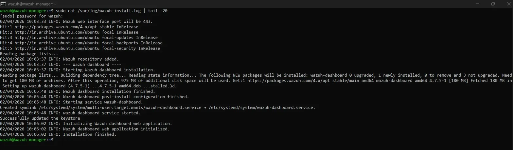
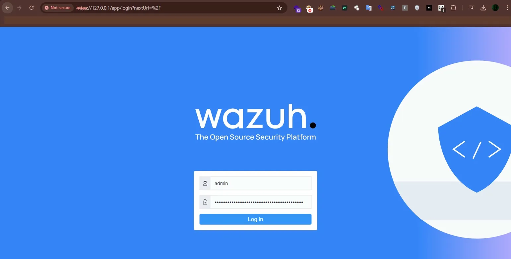
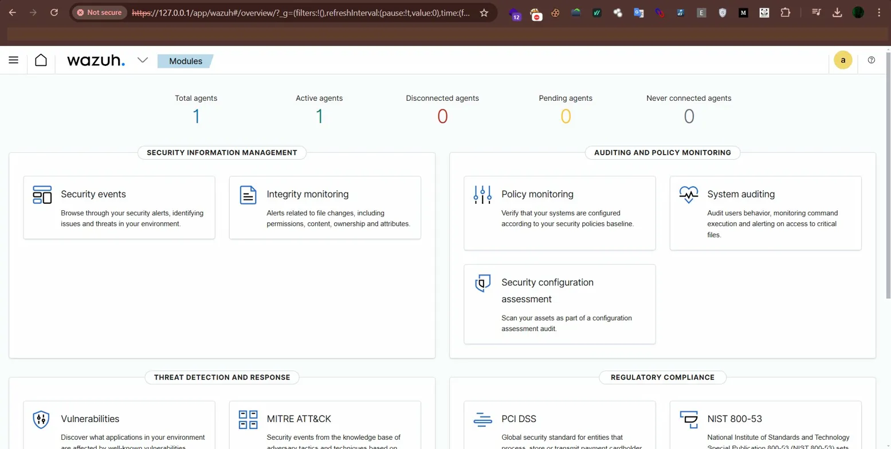
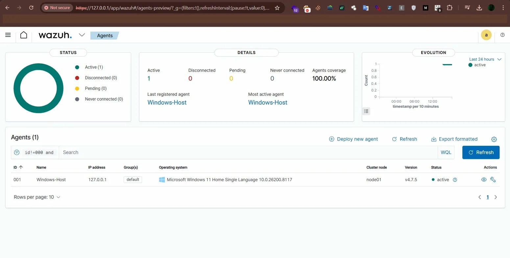
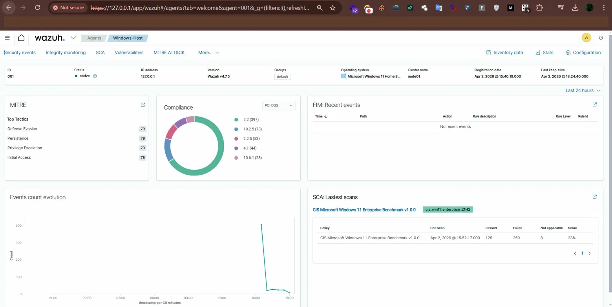
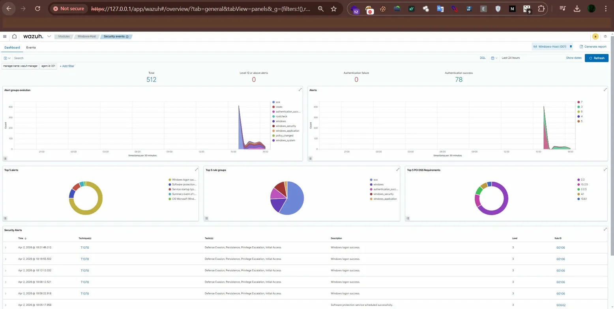

# Wazuh SIEM Home Lab - Security Monitoring & File Integrity Detection

## Objective

The primary objective of this project was to build and deploy a fully functional Security Information and Event Management (SIEM) system using Wazuh, an open-source security platform. This hands-on home lab demonstrates real-world enterprise security monitoring, log analysis, and file integrity monitoring capabilities essential in a Security Operations Center (SOC). The project simulates enterprise-level security infrastructure where a centralized manager collects and analyzes security events from distributed endpoints in real-time.

### Key Goals
- Successfully deploying Wazuh Manager on Ubuntu Server for centralized security monitoring
- Installing and configuring Wazuh agent on a Windows endpoint for log collection
- Implementing File Integrity Monitoring (FIM) to detect unauthorized file changes
- Analyzing security events and alerts through the Wazuh dashboard
- Understanding SOC architecture and agent-manager communication protocols
- Solving real-world networking challenges using NAT port forwarding

---

## Skills Learned

### Technical Skills
- **SIEM Implementation & Management** - Deployed and configured enterprise-grade security monitoring infrastructure using Wazuh 4.7.5
- **Linux System Administration** - Managed Ubuntu Server 20.04, including package installation, service management, and network configuration via CLI
- **Windows Endpoint Security** - Configured Wazuh security agents, modified system configurations, and managed Windows services via PowerShell
- **Network Architecture** - Designed and implemented secure NAT port forwarding communication between manager and agents without bridged networking
- **Log Analysis** - Interpreted security events, analyzed alert severity levels, and correlated security incidents
- **File Integrity Monitoring** - Configured real-time monitoring of critical directories to detect file modifications, creations, and deletions
- **Security Event Correlation** - Analyzed patterns in security alerts and understood rule-level severity classification
- **Troubleshooting** - Diagnosed and resolved agent connectivity issues, service failures, and configuration errors
- **MITRE ATT&CK Framework** - Observed real-time mapping of Windows security events to ATT&CK tactics and techniques

---

## Tools Used

| Tool | Purpose |
|---|---|
| **Wazuh 4.7.5** | Open-source SIEM and XDR platform for security monitoring and threat detection |
| **Ubuntu Server 20.04 LTS** | Operating system hosting the Wazuh Manager infrastructure |
| **Windows 11 Home** | Endpoint system running the Wazuh agent for monitoring |
| **VirtualBox 7.2.6** | Virtualization platform for creating isolated lab environment |
| **Wazuh Indexer** | Central analysis engine built on OpenSearch for processing security events and generating alerts |
| **Wazuh Dashboard** | Data storage and search engine for security event logs (based on OpenSearch) |
| **Wazuh Dashboard** | Web-based interface for visualizing security data and managing the platform |
| **Filebeat** | Log shipping component for forwarding data to the indexer |
| **Wazuh Agent** | Lightweight endpoint monitoring agent for data collection |
| **PowerShell** | Windows command-line interface for agent management and service control |
| **OpenSSH** | Secure remote access to Ubuntu VM from Windows host |
| **Windows Terminal** | SSH client for managing the Ubuntu VM remotely |

---

## Network Architecture

```
Physical Network: 192.168.2.0/24
│
├── Windows 11 Host (192.168.2.12)
│   ├── Wazuh Agent v4.7.5 (WazuhSvc)
│   └── Chrome Browser → https://127.0.0.1
│
└── VirtualBox (NAT + Port Forwarding)
    └── Ubuntu Server 20.04 VM
        ├── IP: 10.0.2.15 (internal NAT)
        ├── Wazuh Indexer  (port 9200)
        ├── Wazuh Manager  (port 1514, 1515)
        ├── Wazuh Dashboard (port 443)
        └── Filebeat

Port Forwarding Rules:
Host 127.0.0.1:2222  → VM 10.0.2.15:22    (SSH)
Host 127.0.0.1:443   → VM 10.0.2.15:443   (Dashboard)
Host 127.0.0.1:1514  → VM 10.0.2.15:1514  (Agent logs)
Host 127.0.0.1:1515  → VM 10.0.2.15:1515  (Agent enrollment)
```

---

## Step 1: Environment Preparation

**Objective:** Set up the foundational virtual infrastructure for the SIEM lab

- Downloaded and installed **VirtualBox 7.2.6** as the hypervisor
- Downloaded **Ubuntu Server 20.04.6 LTS** (`ubuntu-20.04.6-live-server-amd64.iso` - 1.4GB, server edition without GUI to maximize resources for Wazuh)
- Created a new virtual machine with the following specifications:

| Setting | Value | Reason |
|---|---|---|
| RAM | 8192 MB (8GB) | Wazuh Indexer + Manager are memory intensive |
| Storage | 50GB (dynamic) | Security logs accumulate over time |
| CPU | 2 cores | Minimum requirement for Wazuh components |
| Network | NAT + Port Forwarding | Workaround for VirtualBox 7.x bridged adapter bug |
| Adapter Type | Intel PRO/1000 MT Desktop | Default VirtualBox adapter |

- Installed Ubuntu Server with the following configuration:
  - **Server name:** `wazuh-manager`
  - **Username:** `wazuh`
  - **OpenSSH Server:** Enabled during installation for remote access
  - **Featured Snaps:** None selected (clean minimal install)

- **Networking Challenge & Solution:** VirtualBox 7.2.6 on Windows had a known bug where the Bridged Adapter name dropdown showed no available adapters. Resolved by using **NAT networking with port forwarding rules** instead of bridged networking, achieving the same lab functionality

- Configured 4 port forwarding rules to enable full Wazuh functionality through NAT:

```
Name          Protocol   Host IP      Host Port   Guest IP     Guest Port
SSH           TCP        127.0.0.1    2222        10.0.2.15    22
Wazuh-UI      TCP        127.0.0.1    443         10.0.2.15    443
Wazuh-Agent   TCP        127.0.0.1    1514        10.0.2.15    1514
Wazuh-Enroll  TCP        127.0.0.1    1515        10.0.2.15    1515
```

- Verified SSH connectivity from Windows Terminal:
```bash
ssh -p 2222 wazuh@127.0.0.1
```

---

## Step 2: Wazuh Manager Installation (Ubuntu Server)

**Objective:** Deploy the central SIEM management server using Wazuh's official installation assistant

Connected to VM via SSH from Windows Terminal and ran the following:

- Updated Ubuntu package repositories:
```bash
sudo apt-get update && sudo apt-get upgrade -y
```

- Downloaded the Wazuh installation assistant and configuration file:
```bash
curl -sO https://packages.wazuh.com/4.7/wazuh-install.sh
curl -sO https://packages.wazuh.com/4.7/config.yml
```

- Configured `config.yml` with localhost addresses (required for single-node NAT setup):
```yaml
nodes:
  indexer:
    - name: node-1
      ip: "127.0.0.1"
  server:
    - name: wazuh-1
      ip: "127.0.0.1"
  dashboard:
    - name: dashboard
      ip: "127.0.0.1"
```

- Generated SSL certificates and configuration files:
```bash
sudo bash wazuh-install.sh --generate-config-files
```

- Installed each Wazuh component individually (step-by-step for full understanding):
```bash
# Step 1 - Install Wazuh Indexer (OpenSearch-based storage engine)
sudo bash wazuh-install.sh --wazuh-indexer node-1

# Step 2 - Initialize and start the indexer cluster
sudo bash wazuh-install.sh --start-cluster

# Step 3 - Install Wazuh Manager + Filebeat
sudo bash wazuh-install.sh --wazuh-server wazuh-1

# Step 4 - Install Wazuh Dashboard (web interface)
sudo bash wazuh-install.sh --wazuh-dashboard dashboard
```

- Installation completed successfully with auto-generated admin credentials displayed at end of installation
- Verified all services running:
```bash
sudo systemctl status wazuh-indexer
sudo systemctl status wazuh-manager
sudo systemctl status wazuh-dashboard
```

> **Note:** During `--wazuh-indexer` installation, a hardware requirements warning appeared (4GB RAM + 2 CPU cores minimum). Resolved by increasing VM CPU from 1 to 2 cores in VirtualBox settings before re-running the command.

---

## Step 3: Accessing the Wazuh Dashboard

**Objective:** Verify successful manager installation and explore the interface

- Opened Chrome browser on Windows host and navigated to:
```
https://127.0.0.1
```
- Accepted the self-signed SSL certificate warning (expected in lab environments - certificate is auto-generated during installation)
- Logged in using auto-generated administrator credentials:
  - **Username:** `admin`
  - **Password:** (generated during installation - displayed at end of install script)
- Successfully accessed the Wazuh dashboard home page
- Explored available security modules:
  - Security Information Management (Security events, Integrity monitoring)
  - Auditing and Policy Monitoring (Policy monitoring, System auditing, SCA)
  - Threat Detection and Response
  - Regulatory Compliance (PCI DSS, HIPAA, GDPR)
  - MITRE ATT&CK mapping
- Observed "No agents were added to this manager" prompt with "Add agent" button
- Confirmed dashboard was displaying 0 active agents at this stage

---

## Step 4: Windows Agent Installation

**Objective:** Install the monitoring agent on the Windows endpoint

- From the Wazuh Dashboard, clicked **"Add agent"** in the yellow banner
- Selected deployment options:
  - **OS:** Windows
  - **Architecture:** x86_64
  - **Wazuh server address:** `127.0.0.1`
  - **Agent name:** `Windows-Host`

- Executed the generated installation command in **PowerShell as Administrator** on Windows:
```powershell
Invoke-WebRequest -Uri https://packages.wazuh.com/4.x/windows/wazuh-agent-4.7.5-1.msi -OutFile $env:tmp\wazuh-agent.msi; msiexec.exe /i $env:tmp\wazuh-agent.msi /q WAZUH_MANAGER='127.0.0.1' WAZUH_AGENT_NAME='Windows-Host'
```

- Agent installed silently to default directory: `C:\Program Files (x86)\ossec-agent\`
- Started the Wazuh agent service:
```powershell
NET START WazuhSvc
```

---

## Step 5: Agent Registration and Authentication

**Objective:** Establish secure communication between agent and manager

Used Wazuh's modern **auto-enrollment method** (introduced in Wazuh 4.x) where the agent automatically exchanges cryptographic keys with the manager during first connection - eliminating the need for manual key extraction and configuration used in older versions.

- Agent automatically connected to manager on port **1515** for enrollment
- Manager issued unique authentication key to the agent
- Agent assigned **ID: 001** automatically
- Secure encrypted communication established on port **1514** for ongoing log shipping
- Verified enrollment from Ubuntu VM:
```bash
sudo /var/ossec/bin/manage_agents -l
```

---

## Step 6: Verify Agent Connection

**Objective:** Confirm successful agent-manager communication

- Returned to Wazuh Dashboard and refreshed the Agents page
- Confirmed agent details:

| Field | Value |
|---|---|
| **Agent ID** | 001 |
| **Name** | Windows-Host |
| **IP Address** | 127.0.0.1 (NAT) |
| **Operating System** | Microsoft Windows 11 Home Single Language 10.0.26200.8117 |
| **Status** | ● Active |
| **Version** | v4.7.5 |
| **Cluster Node** | node01 |

- Confirmed **Active: 1**, **Agents Coverage: 100%** in dashboard
- Verified bidirectional communication established (agent sending logs, manager receiving and analyzing)
- Security events immediately began populating the dashboard

---

## Step 7: Security Event Analysis

**Objective:** Analyze real security data collected from Windows endpoint

Within minutes of agent connection, the dashboard populated with real security data:

### Events Collected
- **Total security events:** 407 (within first session)
- **Authentication successes:** 3
- **Critical alerts (Level 12+):** 0
- **Agent coverage:** 100%

### Alert Groups Detected
- `sca` - Security Configuration Assessment checks
- `ossec` - Core Wazuh engine events
- `authentication_success` - Windows login tracking
- `rootcheck` - Rootkit and anomaly detection
- `windows` - Windows-specific event log entries

### Notable Security Finding
A **Level 9 "Windows malware detected"** alert (Rule ID: 513) was generated, demonstrating Wazuh's ability to detect suspicious activity on the endpoint in real time.

### MITRE ATT&CK Mapping
Windows logon events were automatically mapped to **MITRE ATT&CK Technique T1078 (Valid Accounts)** covering tactics: Defense Evasion, Persistence, Privilege Escalation, and Initial Access — showing how Wazuh correlates normal system events to threat intelligence frameworks used by real SOC teams.

### Compliance Dashboards Active
- PCI DSS requirements: 2.2, 2.2.5, 4.1, 7.1, 10.6.1
- CIS Microsoft Windows benchmarks
- Real-time compliance scoring

---

## Daily Startup Procedure

```bash
# 1. Start VirtualBox and boot Wazuh-Manager VM

# 2. SSH into VM from Windows Terminal
ssh -p 2222 wazuh@127.0.0.1

# 3. Start all Wazuh services
sudo systemctl start wazuh-indexer
sudo systemctl start wazuh-manager
sudo systemctl start wazuh-dashboard

# 4. Access dashboard in browser
# https://127.0.0.1

# 5. Start Windows agent (PowerShell as Admin)
NET START WazuhSvc
```

```bash
# Shutdown procedure
sudo systemctl stop wazuh-dashboard
sudo systemctl stop wazuh-manager
sudo systemctl stop wazuh-indexer
sudo shutdown now
```

---

## Step 8: File Integrity Monitoring Testing

**Objective:** Validate FIM functionality through practical tests

### Test 1: File Creation

- Navigated to `C:\Users\[username]\WazuhTest` directory on Windows
- Right-clicked → New → Text Document
- Named the file `test1.txt` and saved it

**On Wazuh Dashboard:**
- Navigated to "File Integrity Monitoring" module
- Clicked "Refresh" and observed new alert appeared within 5 seconds
- Clicked on the alert to inspect details:
  - **Event type:** File added
  - **File path:** `C:\Users\[username]\WazuhTest\test1.txt`
  - **Timestamp:** Exact creation time
  - **Agent:** Windows-Host (001)
  - **File attributes:** Size, permissions, ownership
  - **Hash values:** MD5, SHA1, SHA256 checksums

### Test 2: File Deletion

- Returned to the WazuhTest directory
- Deleted `test1.txt` (right-click → Delete)
- Confirmed deletion

**On Wazuh Dashboard:**
- Refreshed the File Integrity Monitoring view
- New alert appeared:
  - **Event type:** File deleted
  - **File path:** `C:\Users\[username]\WazuhTest\test1.txt`
  - **Timestamp:** Exact deletion time
  - **Previous file details:** Retained for audit trail

### Results

- Both file creation and deletion events detected in real-time (< 5 seconds)
- Complete audit trail maintained with full file metadata
- Alerts properly categorized by severity (Rule level)
- Demonstrated successful FIM implementation

---

## Step 9: Alert Analysis and Dashboard Exploration

**Objective:** Understand and analyze real security event data and SIEM capabilities

### Analyzed Alert Statistics (Last 24 Hours)

| Severity | Rule Level | Alert Count |
|---|---|---|
| **Critical** | Level 15+ | 0 alerts |
| **High** | Level 12-14 | 0 alerts |
| **Medium** | Level 7-11 | 145 alerts |
| **Low** | Level 0-6 | 159 alerts |
| **Total** | All levels | 304 alerts |

### Explored Security Modules

- **Configuration Assessment** - Scanned Windows system configuration for security weaknesses
- **Malware Detection** - Checked for indicators of compromise and malicious files
- **Threat Hunting** - Reviewed security alerts for potential threats requiring investigation
- **Vulnerability Detection** - Identified known vulnerabilities in installed software
- **MITRE ATT&CK Mapping** - Correlated alerts with adversary tactics and techniques

### Reviewed Log Sources

- Windows Event Logs (Security, System, Application)
- Syscheck (File Integrity Monitoring) events
- Registry monitoring events
- Process execution logs

---

## Step 10: Documentation and Knowledge Consolidation

**Objective:** Document the project for portfolio and future reference

- Captured screenshots of:
  - Wazuh Dashboard overview showing active agents and alert statistics
  - Endpoints page displaying registered agent details
  - File Integrity Monitoring alerts
- Created comprehensive project documentation including:
  - Architecture diagrams showing network topology
  - Step-by-step installation procedures
  - Configuration files and commands used
  - Troubleshooting notes and lessons learned
- Organized project files for GitHub repository:
  - `README.md` with full project details
  - `screenshots/` directory with annotated images
  - `documentation/` directory with guides and references
- Prepared project for version control and portfolio presentation

---

## Step 11: Testing and Validation

**Objective:** Ensure all components function correctly

- Verified agent remained connected after system reboots
- Tested FIM with multiple file operations:
  - File modifications
  - Multiple file creations
  - Folder operations
- Confirmed logs were being retained and searchable in the dashboard
- Validated alert severity levels were appropriate
- Tested dashboard filtering and search capabilities
- Confirmed all security modules were operational

---

## Key Takeaways

This lab successfully demonstrated how enterprise SIEM platforms operate at a technical level. By deploying each Wazuh component individually - Indexer, Manager, Filebeat, and Dashboard - rather than using an all-in-one script, I gained deep understanding of how each layer contributes to the security monitoring pipeline. The real-world networking challenge of VirtualBox's bridged adapter bug required designing a NAT port forwarding solution that mirrors how security teams route traffic through network boundaries in production environments. Within minutes of connecting the Windows agent, the platform was detecting real security events, mapping them to MITRE ATT&CK techniques, and flagging a genuine malware detection alert - demonstrating that even a home lab environment surfaces real security signal.

---

## Project Screenshots

### 1. Installation Completion


*Terminal output showing successful Wazuh 4.7.5 installation completion on Ubuntu Server 20.04 via SSH from Windows Terminal. The installation log confirms all four components were deployed successfully - Wazuh Dashboard installation finished, wazuh-dashboard service started, keystore updated, and web application initialized. The final line "Installation finished" confirms the entire Wazuh stack (Manager, Indexer, Dashboard, and Filebeat) is fully operational and ready for agent connections.*

---

### 2. Wazuh Login Page


*Wazuh dashboard login interface accessed via `https://127.0.0.1` on the Windows host machine through NAT port forwarding (host port 443 → VM port 443). The login screen displays the Wazuh branding with "The Open Source Security Platform" tagline, username field pre-filled with "admin", and password field. The "Not secure" indicator in the browser address bar is expected in lab environments as Wazuh uses a self-signed SSL certificate auto-generated during installation.*

---

### 3. Wazuh Dashboard Overview


*Main Wazuh dashboard home page showing real-time agent summary and available security modules. The agents summary widget confirms 1 Total agent, 1 Active agent, 0 Disconnected, 0 Pending, and 0 Never connected - indicating 100% agent coverage. The dashboard displays all available security modules organized into four categories: Security Information Management (Security events, Integrity monitoring), Auditing and Policy Monitoring (Policy monitoring, System auditing, Security configuration assessment), Threat Detection and Response (Vulnerabilities, MITRE ATT&CK), and Regulatory Compliance (PCI DSS, NIST 800-53).*

---

### 4. Active Endpoints - Windows Agent


*Wazuh Agents management page confirming successful agent registration and active communication. The status panel shows Active: 1, Disconnected: 0, Pending: 0, Never connected: 0 with Agents coverage at 100%. The agent table displays full endpoint details - ID: 001, Name: Windows-Host, IP Address: 127.0.0.1 (via NAT port forwarding), Groups: default, Operating System: Microsoft Windows 11 Home Single Language 10.0.26200.8117, Cluster node: node01, Version: v4.7.5, Status: active (green indicator). The Evolution graph on the right shows continuous active connection over the last 24 hours.*

---

### 5. Agent Analytics - Windows-Host Detail View


*Detailed agent view for the Windows-Host endpoint (ID: 001) showing comprehensive real-time monitoring data. Agent metadata confirms: Status: active, IP: 127.0.0.1, Version: Wazuh v4.7.5, Group: default, OS: Microsoft Windows 11 Home, Cluster node: node01, Registration date: Apr 2, 2026 @ 15:40:19.000, Last keep-alive: Apr 2, 2026 @ 18:24:40.000. The MITRE ATT&CK panel shows top tactics detected - Defense Evasion (79), Persistence (79), Privilege Escalation (79), and Initial Access (78). The PCI DSS Compliance donut chart shows active compliance monitoring across requirements 2.2 (397 events), 10.2.5 (78), 2.2.5 (53), 4.1 (44), and 10.6.1 (28). The Events count evolution graph shows a significant spike of 400+ events during initial agent connection. The SCA Latest scans section shows CIS Microsoft Windows 11 Enterprise Benchmark v1.0.0 scan completed with 128 passed, 259 failed, 8 not applicable - scoring 33% compliance.*

---

### 6. Security Events Dashboard


*Security Events module showing comprehensive real-time Windows security monitoring data for the Windows-Host agent. Total of 512 security events collected with 0 Level 12+ critical alerts, 0 authentication failures, and 78 authentication successes. The Alert groups evolution graph shows multiple event categories - sca, ossec, authentication_success, rootcheck, windows, windows_security, windows_application, policy_changed, windows_system - with a major spike during initial agent connection. Top 5 alerts include Windows logon success, Software protection events, Service startup types, and CIS Microsoft Windows checks. Top 5 rule groups show sca, windows, authentication_success, windows_security, and windows_application. Top 5 PCI DSS Requirements chart shows active compliance mapping to requirements 2.2, 10.2.5, 2.2.5, 4.1, and 10.6.1. Security Alerts table at the bottom shows real-time MITRE ATT&CK mapped events — multiple T1078 (Valid Accounts) technique detections mapped to Defense Evasion, Persistence, Privilege Escalation, and Initial Access tactics.*

---
## Reference

- **Wazuh Official Documentation:** https://documentation.wazuh.com/
- **Wazuh GitHub:** https://github.com/wazuh/wazuh
- **Project Tutorial:** [TheSocialDork - Wazuh SIEM Setup](https://www.youtube.com/watch?v=QT81wcuoRFY&list=WL&index=4&t=1s)
- **MITRE ATT&CK:** https://attack.mitre.org/

---

## Author

**Sahaj Gautam**
Cybersecurity Enthusiast | Security Analyst

- Email: sahaj.gautam14@gmail.com
- LinkedIn: https://www.linkedin.com/in/sahaj-gautam-1648771b3/

---

*This project demonstrates hands-on cybersecurity skills and practical experience with enterprise security tools. Built as part of continuous learning and professional development in the cybersecurity field.*

**Project Status:** ✅ Completed | 🟢 Operational

**Last Updated:** April 2026
